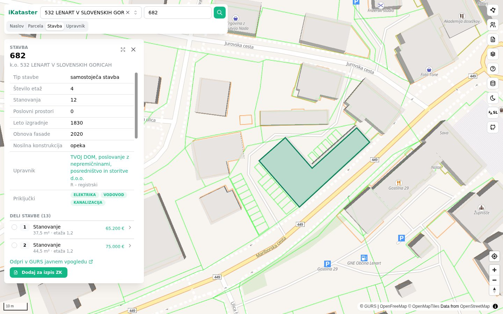
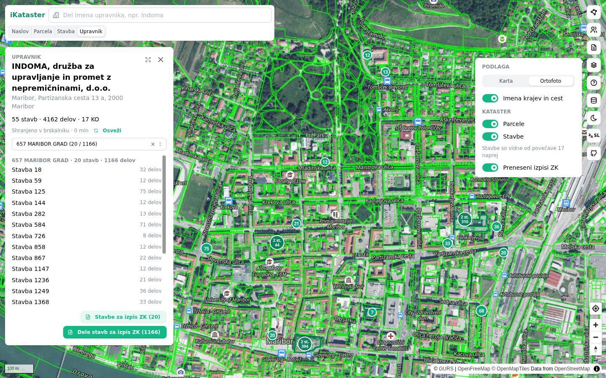
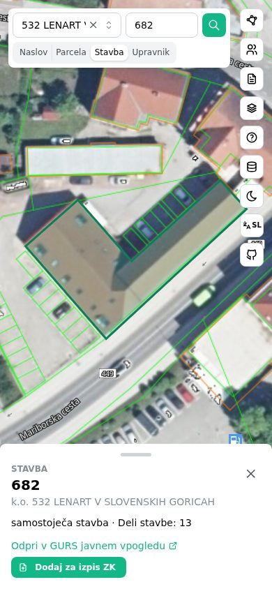
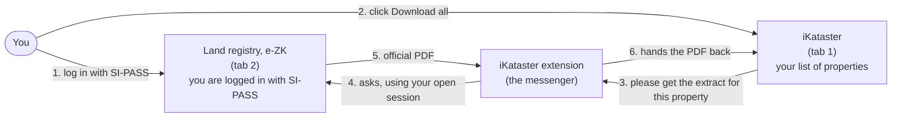

# iKataster

A fast web app for looking up Slovenian real estate: parcels, buildings, building parts and building managers, on a map, straight from the public data of the Surveying and Mapping Authority (GURS). With the companion browser extension it also downloads land-registry extracts (e-ZK) through your own SI-PASS login and turns them into searchable tables.

There is no backend and no account: the app is a static site that runs entirely in your browser, and everything you save (lists, extracts, folders) stays on your device. The user interface is in Slovenian, with an English option.



| Building manager portfolio on the aerial photo | Phone |
|---|---|
|  |  |

> **Slovensko:** iKataster je brezplačna spletna aplikacija za pregled parcel, stavb, delov stavb in upravnikov na zemljevidu, z javnimi podatki GURS (posplošena vrednost, prodaje in najemi iz ETN). Z razširitvijo za brskalnik prek vaše prijave SI-PASS prenaša izpiske iz zemljiške knjige in iz njih izpiše lastnike, hipoteke in služnosti. Brez strežnika in brez računa: vsi podatki ostanejo v vašem brskalniku.

If iKataster is useful to you, a ⭐ on GitHub helps other people find it.

## How downloading land-registry extracts works

*Plain-language overview. You don't need any technical knowledge.*

iKataster can't log into the land registry for you, and it never sees your password. You log in yourself, the normal way, and the small iKataster browser extension then passes requests between the two tabs.



### Step by step

1. **Install the extension once** (Chrome, Edge or Firefox on a computer). The app shows the steps under *Seznam za izpise ZK → Navodila za namestitev*.
2. **Open the land registry** ([e-Sodstvo, e-ZK](https://esodisce.si/)) in another tab and **log in with your SI-PASS** as usual. Keep that tab open.
3. **In iKataster, add properties to the list** *Seznam za izpise ZK* (one by one, by drawing an area, or by importing a spreadsheet).
4. **Click download.** For each property the extension asks the land-registry tab for the official extract, the same way you would by hand, and gives the PDF back to iKataster.
5. **iKataster reads the PDFs** and shows owners, shares, mortgages and easements in clear tables that you can filter and export.

### Good to know

| Question | Answer |
|---|---|
| Does iKataster see my SI-PASS password? | No. You only enter it on the official SI-PASS/e-Sodstvo pages. |
| Where are my extracts stored? | Only in your browser, on your computer. Nothing is uploaded to an iKataster server, because there isn't one. |
| Why do I need the extension? | For security, a website isn't allowed to read another website's tab. The extension is the permitted bridge, and it only talks to iKataster and e-ZK. |
| What if I log out or the session expires? | Downloads pause and the app asks you to log in to e-ZK again, then continue. |
| Is there a limit? | Yes. e-Sodstvo allows about 400 extracts per user per day; the app counts them and stops before the limit. |
| Does it work on a phone? | Searching and the map do. Bulk downloading needs the extension, so use a computer; on a phone you can upload PDFs you already have. |

## Features

- **Map**: street map or aerial photo (GURS orthophoto) with cadastral parcels and building outlines on top.
- **Search**: by address, parcel (cadastral municipality + number), building, or building manager (*upravnik*).
- **Details**: parcel area, land use and zoning, GURS mass-appraisal value (*posplošena vrednost*); building attributes, connections, and every building part with its use, area and floor.
- **Area selection**: draw a polygon to collect all parcels or buildings inside it.
- **List import**: paste or upload CSV/TSV/TXT/XLSX lists of parcels or building parts, validated against GURS.
- **Land-registry extracts** (desktop, with the extension): queue many e-ZK extracts, respect the daily limit, and parse owners, shares, mortgages, easements and other rights from the PDFs.
- **Results and export**: filter results, save them in folders, export to Excel/CSV or a ZIP with the source PDFs.
- **Offline and fast**: answers from GURS and aerial tiles are cached as you browse; pin a cadastral municipality to use it offline. Installable as a PWA.
- **Backup**: export and restore all local data as one file.

## Privacy

- iKataster has no server of its own that sees your searches or extracts. The browser fetches map tiles and data directly from the public services listed under *Data sources* (as any map site would), and the extension talks only to the e-ZK portal in your own logged-in browser session.
- Local data lives in IndexedDB in your browser. Use *Podatki → Varnostna kopija* to back it up.

## Repository layout

| Path | What it is |
|---|---|
| `apps/web` | The web app (React, React Router in library mode, Mantine, MapLibre GL, Dexie) |
| `packages/bridge` | Message protocol between the app and the extension |
| `packages/extension` | Manifest V3 extension for Chrome, Edge and Firefox |

## Getting started

Requirements: Node.js 22+.

```bash
cp .env.example .env      # set IKATASTER_ORIGINS to your hosting origin(s)
npm install
npm run dev               # app on http://localhost:5173
npm test                  # all unit and flow tests
npm run build             # production build of the app
npm run build -w @ikataster/extension   # extension zips in packages/extension/dist
```

`IKATASTER_ORIGINS` is a comma-separated list of the https origins where you host the app (`http://localhost` and `http://127.0.0.1` are always allowed for development). It is injected at build time into the extension (which pages it may talk to) and the app's bridge allowlist, so no hosting domain is hard-coded in the source.

### Run with Docker

```bash
docker compose up -d --build
```

The image runs the tests, builds the app and the extension, and serves everything with nginx on `127.0.0.1:3119`. Put your own reverse proxy with TLS in front of it.

### Installing the extension

The built app serves the extension zips under `/extension/`. In the app open *Seznam za izpise ZK → Navodila za namestitev* for step-by-step instructions (load unpacked in Chrome/Edge, temporary add-on in Firefox). After installing, reload the app tab once.

## Data sources

- Cadastre, buildings, addresses and orthophoto: [GURS](https://www.e-prostor.gov.si/) public WMS/WFS services, © GURS.
- Basemap: [OpenFreeMap](https://openfreemap.org/), © OpenStreetMap contributors.
- Mass-appraisal values: GURS, Evidenca vrednotenja (CC BY 4.0), pre-split per cadastral municipality on the [`data` branch](https://github.com/ibracic/ikataster/tree/data) by `scripts/valuations/build.py` (values only, no ownership data).
- Land-registry extracts: [e-ZK on e-Sodstvo](https://esodisce.si/), downloaded by the user through their own SI-PASS session.

iKataster is an independent project and is not affiliated with GURS or the Slovenian judiciary. Data is provided as is; always check official sources for legal purposes.

## License

[MIT](LICENSE) © Igor Bračič
